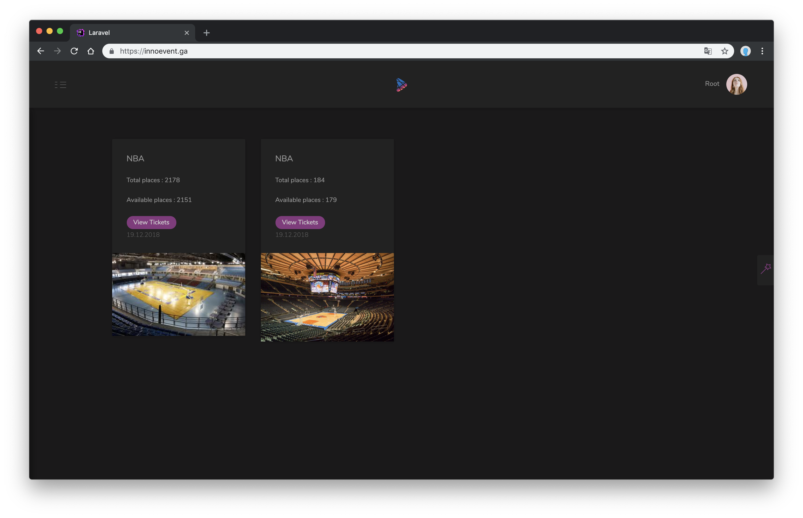

# InnoEvent Website

     

 

## Software

### Laval GLO-2004 : Génie logiciel orienté objet

This project was done under the "Génie logiciel orienté objet" class at the Laval University - Quebec 

Demo here: https://innoevent.ga or https://innoevent.emodyz.eu
You can login with **root@root.com** and password **root**

You can also buy ticket with this credit card: **5555 5555 5555 4444** expiration date **02/22** ( don't wories it's test card, real card was disabled )

### Project

InnoEvent is an event creation software that allows you to define the seating plan for concerts, ballets and sports matches for
example. 
This software allows to configure the room plan of different ways through its different features. 
You can find the subject (in French) at the root directory.

----------

## Screenshots

----------

# Getting started

## Installation

Please check the official laravel installation guide for server requirements before you start. [Official Documentation](https://laravel.com/docs/5.7/installation#installation)

Clone the repository

    git clone git@github.com:MrDarkSkil/InnoEvent-Website.git

Switch to the repo folder

    cd InnoEvent-Website

Install all the dependencies using composer

    composer install

Copy the example env file and make the required configuration changes in the .env file

    cp .env.example .env

Open **.env** file and setup the database connection variables

    DB_CONNECTION=mysql
    DB_HOST=127.0.0.1
    DB_PORT=3306
    DB_DATABASE=homestead
    DB_USERNAME=homestead
    DB_PASSWORD=secret

For Billing support don't forget to setup **.env** braintree variables [BrainTree Website](https://www.braintreepayments.com/)

    BRAINTREE_ENV=sandbox
    BRAINTREE_MERCHANT_ID=yourMerchantId
    BRAINTREE_PUBLIC_KEY=yourPublicKey
    BRAINTREE_PRIVATE_KEY=yourPrivateKey

Generate a new application key

    php artisan key:generate

Run the database migrations (**Set the database connection in .env before migrating**)

    php artisan migrate:fresh --seed

Start the local development server

    php artisan serve

You can now access the server at http://localhost:8000

**TL;DR command list**

    git clone git@github.com:MrDarkSkil/InnoEvent-Website.git
    cd InnoEvent-Website
    composer install
    cp .env.example .env
    php artisan key:generate
    
**Make sure you set the correct database connection information before running the migrations** [Environment variables](#environment-variables)

    php artisan migrate:fresh --seed
    php artisan serve

## Database seeding

**Populate the database with seed data with relationships which includes default users. This can help you to quickly start testing the api or couple a frontend and start using it with ready content.**

Open the DummyDataSeeder and set the property values as per your requirement

    database/seeds/UserTableSeeder.php

Run the database seeder and you're done

    php artisan db:seed

***Note*** : It's recommended to have a clean database before seeding. You can refresh your migrations at any point to clean the database by running the following command

    php artisan migrate:refresh

----------

# Code overview

## Dependencies

- [laravel/cashier-braintree](https://github.com/laravel/cashier-braintree) - For billing system with braintree

## Folders

- `app` - Contains all the Eloquent models
- `app/Http/Controllers/Api` - Contains all the api controllers
- `app/Http/Middleware` - Contains auth middlewar and other
- `config` - Contains all the application configuration files
- `database/factories` - Contains the model factory for all the models
- `database/migrations` - Contains all the database migrations
- `database/seeds` - Contains the database seeder
- `routes` - Contains all the api routes defined in api.php file
- `tests` - Contains all the application tests
- `tests/Feature/Api` - Contains all the api tests

## Environment variables

- `.env` - Environment variables can be set in this file

***Note*** : You can quickly set the database information and other variables in this file and have the application fully working.

----------

# Testing Website

Run the laravel development server

    php artisan serve

The login page can now be accessed at

    http://localhost:8000/login

Default user as: **root@root.com** with **root** for password

And if you want to setup laravel 

